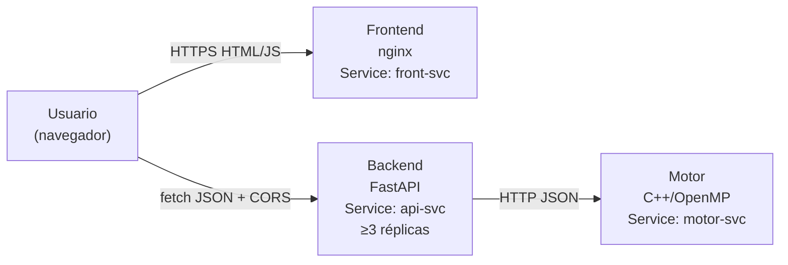

# 01 – Arquitectura del Sistema

## Visión general

El sistema es un motor de juego para Mancala Kalah(6,4) expuesto como microservicio web. Está compuesto por cuatro contenedores independientes orquestados con Kubernetes:

- **Motor** (C++/OpenMP): ejecuta Minimax con poda Alfa-Beta, exposición HTTP interna.
- **Backend** (Python/FastAPI): API pública REST que valida la entrada y delega al motor.
- **Frontend** (nginx + HTML/JS): interfaz web jugable servida como archivos estáticos.
- **Base de datos** (opcional): no incluida en esta versión.

Cada componente vive en su propio contenedor y se comunica exclusivamente a través de la red del clúster, sin ningún acoplamiento en proceso (no se usa `pybind11` ni `ctypes`).

## Diagrama de orquestación



## Descripción de contenedores

### Motor (`motor/`)

- Imagen base: `ubuntu:22.04`
- Compilado con `g++ -O3 -fopenmp`
- Expone el endpoint interno `POST /compute` en el puerto `8080`
- Variables: `OMP_NUM_THREADS` (desde ConfigMap)
- Recibe: `{ board[14], side, depth, threads }`
- Devuelve: `{ move, evaluation, elapsed_ms, stats, threads_used }`

### Backend (`backend/`)

- Python 3.12 + FastAPI + httpx (cliente async al motor)
- Puerto `8000`; ≥ 3 réplicas en Kubernetes
- Valida el JSON con Pydantic v2; rechaza con HTTP 422 entradas inválidas
- Endpoints: `POST /move`, `GET /healthz`, `GET /readyz`, `GET /metrics`

### Frontend (`frontend/`)

- Archivo estático `index.html` servido por nginx
- Puerto `80`; 1 réplica
- El JS del cliente llama a `api-svc` con `fetch` + CORS
- Tablero interactivo: modo Humano-IA y IA-IA

## Contrato de la API REST

### `POST /move`

**Request** (`Content-Type: application/json`):

```json
{
  "board":   [4,4,4,4,4,4,0, 4,4,4,4,4,4,0],
  "side":    0,
  "depth":   8,
  "threads": 4
}
```

**Response 200**:

```json
{
  "move":         2,
  "evaluation":   3,
  "elapsed_ms":   145,
  "threads_used": 4,
  "stats": {
    "nodes":  1845210,
    "prunes": 312088
  }
}
```

**Codificación del tablero** (14 enteros, orden canónico):

| Índice | Significado |
|--------|-------------|
| 0 – 5 | Hoyos del Jugador 0 (izquierda → derecha) |
| 6 | Kalaha del Jugador 0 (almacén) |
| 7 – 12 | Hoyos del Jugador 1 (derecha → izquierda desde P0) |
| 13 | Kalaha del Jugador 1 |

**Errores**: 400 tablero inválido, 422 fallo de validación de esquema, 500 error interno, 503 motor no disponible.

### `GET /healthz`, `GET /readyz`, `GET /metrics`

Ver [02-motor.md](02-motor.md) para `/healthz` del motor y [06-cicd.md](06-cicd.md) para el uso de `/metrics` en Prometheus.

## Política de CORS

El backend configura `CORSMiddleware` explícitamente:

```python
app.add_middleware(
    CORSMiddleware,
    allow_origins=["http://localhost:8090",
                   "http://FRONTEND_EXTERNAL_IP"],
    allow_methods=["GET", "POST", "OPTIONS"],
    allow_headers=["Content-Type"],
)
```

- No se usa el comodín `"*"` en producción.
- Se manejan correctamente las *preflight* `OPTIONS`.
- Los orígenes permitidos se inyectan desde el ConfigMap de Kubernetes.
