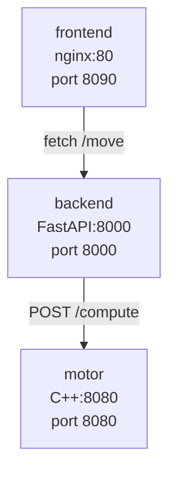
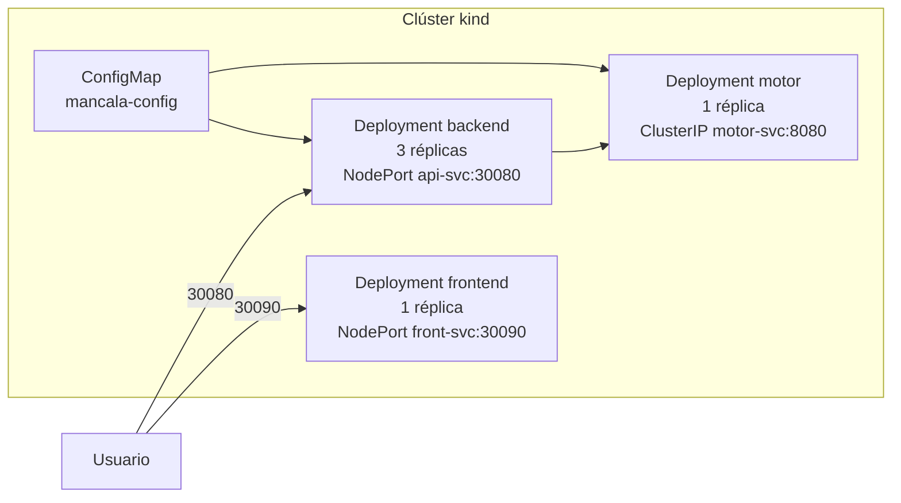

# 04 – Despliegue Local

## Dockerfiles

### Motor (`motor/Dockerfile`)

Construcción en dos etapas:
1. **builder** (`ubuntu:22.04`): instala CMake, g++, OpenMP; compila con `-O3`.
2. **runtime** (`ubuntu:22.04`): copia solo el binario y la suite de benchmark.

Variables de entorno: `OMP_NUM_THREADS` (default 4, sobreescrito por Kubernetes ConfigMap).

### Backend (`backend/Dockerfile`)

`python:3.12-slim`, instala dependencias desde `requirements.txt`, expone el puerto `8000`.

### Frontend (`frontend/Dockerfile`)

`nginx:1.25-alpine`, copia `index.html` y `nginx.conf`, expone el puerto `80`.

## Diagrama de flujo de contenedores (Docker Compose)



## `docker-compose.yml` (comentado)

```yaml
services:
  motor:          # contenedor 1: motor C++/OpenMP
    build: ../../motor
    environment:
      OMP_NUM_THREADS: "4"   # Hilos OpenMP

  backend:        # contenedor 2: wrapper FastAPI
    build: ../../backend
    depends_on:
      motor:
        condition: service_healthy
    environment:
      MOTOR_URL: "http://motor:8080"   # Dirección interna del motor

  frontend:       # contenedor 3: cliente web nginx
    build: ../../frontend
    ports:
      - "8090:80"      # Accesible en http://localhost:8090
```

### Levantar la aplicación completa

```bash
cd deploy/local
docker compose up --build
# Acceder en http://localhost:8090
```

## Entorno Kubernetes local (kind)

### Requisitos previos

```bash
# Instalar kind
go install sigs.k8s.io/kind@latest

# Crear clúster local
kind create cluster --name mancala

# Cargar imágenes locales al clúster
kind load docker-image mancala-motor:local   --name mancala
kind load docker-image mancala-backend:local --name mancala
kind load docker-image mancala-frontend:local --name mancala
```

### Aplicar manifiestos

```bash
cd deploy/local/k8s
kubectl apply -f configmap.yaml
kubectl apply -f motor-deployment.yaml
kubectl apply -f motor-service.yaml
kubectl apply -f backend-deployment.yaml
kubectl apply -f backend-service.yaml
kubectl apply -f frontend-deployment.yaml
kubectl apply -f frontend-service.yaml
```

### Verificar estado

```bash
kubectl get pods,svc,deploy
```

Salida esperada:
```
NAME                            READY   STATUS    RESTARTS   AGE
pod/motor-xxxx                  1/1     Running   0          30s
pod/backend-xxxx (×3)           1/1     Running   0          25s
pod/frontend-xxxx               1/1     Running   0          20s

NAME            TYPE        CLUSTER-IP    PORT(S)
motor-svc       ClusterIP   10.96.x.x     8080/TCP
api-svc         NodePort    10.96.x.x     8000:30080/TCP
front-svc       NodePort    10.96.x.x     80:30090/TCP
```

### Acceder a la aplicación

```bash
# Obtener IP del nodo
kubectl get nodes -o wide
# Navegar a http://NODE_IP:30090
```

## Diagrama Mermaid de despliegue Kubernetes local


