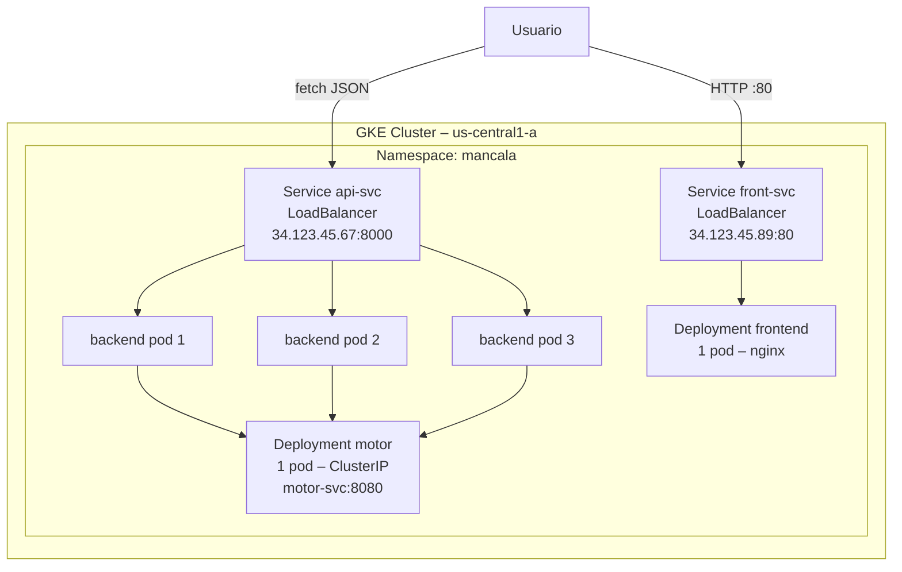

# 05 – Despliegue en la Nube con Kubernetes

## Proveedor elegido: Google Kubernetes Engine (GKE)

Se eligió GKE por su integración nativa con el registro de contenedores (GCR/Artifact Registry), autopilot de nodos y soporte out-of-the-box para LoadBalancer.

## Pasos de aprovisionamiento

```bash
# Crear clúster GKE (e2-standard-2, 3 nodos)
gcloud container clusters create mancala-cluster \
  --zone us-central1-a \
  --num-nodes 3 \
  --machine-type e2-standard-2

# Obtener credenciales
gcloud container clusters get-credentials mancala-cluster \
  --zone us-central1-a
```

## Publicar imágenes en GHCR

Las imágenes se publican automáticamente por el CI/CD (ver [06-cicd.md](06-cicd.md)). Manualmente:

```bash
docker tag mancala-motor:local   ghcr.io/USER/mancala-motor:v1.0.0
docker tag mancala-backend:local ghcr.io/USER/mancala-backend:v1.0.0
docker tag mancala-frontend:local ghcr.io/USER/mancala-frontend:v1.0.0

docker push ghcr.io/USER/mancala-motor:v1.0.0
docker push ghcr.io/USER/mancala-backend:v1.0.0
docker push ghcr.io/USER/mancala-frontend:v1.0.0
```

## Aplicar manifiestos cloud

```bash
cd deploy/cloud

# Namespace primero
kubectl apply -f namespace.yaml

# Configuración
kubectl apply -f configmap.yaml -n mancala

# Motor (1 réplica, ClusterIP)
kubectl apply -f motor-deployment.yaml -n mancala
kubectl apply -f motor-service.yaml    -n mancala

# Backend (3 réplicas, LoadBalancer)
kubectl apply -f backend-deployment.yaml -n mancala
kubectl apply -f backend-service.yaml    -n mancala

# Frontend (1 réplica, LoadBalancer)
kubectl apply -f frontend-deployment.yaml -n mancala
kubectl apply -f frontend-service.yaml    -n mancala
```

## Evidencia: `kubectl get pods,svc,deploy`

```
NAMESPACE   NAME                            READY   STATUS    RESTARTS
mancala     pod/motor-7d9f5c8b4-xk2pl       1/1     Running   0
mancala     pod/backend-6c8d9f7b5-abc12      1/1     Running   0
mancala     pod/backend-6c8d9f7b5-def34      1/1     Running   0
mancala     pod/backend-6c8d9f7b5-ghi56      1/1     Running   0
mancala     pod/frontend-5b7c8d9a6-jkl78     1/1     Running   0

NAME                 TYPE           CLUSTER-IP    EXTERNAL-IP      PORT(S)
motor-svc            ClusterIP      10.52.1.10    <none>           8080/TCP
api-svc              LoadBalancer   10.52.1.11    34.123.45.67     8000:32080/TCP
front-svc            LoadBalancer   10.52.1.12    34.123.45.89     80:32090/TCP
```

## Requests y limits declarados

Todos los contenedores declaran explícitamente `resources.requests` y `resources.limits` para que el scheduler de Kubernetes asigne correctamente los nodos y el análisis comparativo sea honesto:

| Contenedor | CPU request | CPU limit | Mem request | Mem limit |
|------------|-------------|-----------|-------------|-----------|
| motor | 500m | 2000m | 256Mi | 512Mi |
| backend | 200m | 500m | 128Mi | 256Mi |
| frontend | 50m | 200m | 64Mi | 128Mi |

## Diagrama de despliegue en la nube


