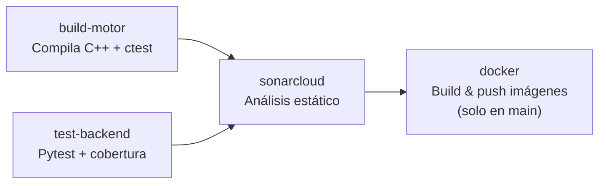

# 06 – CI/CD y Calidad de Código

## Pipeline GitHub Actions

El archivo `.github/workflows/ci.yml` implementa cuatro jobs que se ejecutan en cada push a `main`/`master`:



### Job 1: `build-motor`

```yaml
- cmake -B build -DCMAKE_BUILD_TYPE=Release motor/
- cmake --build build --parallel $(nproc)
- ctest --output-on-failure         # ejecuta test_kalah
- ./mancala_bench --depth 6 ...     # sanity check
```

### Job 2: `test-backend`

```yaml
- pip install -r backend/requirements.txt pytest pytest-cov
- pytest tests/ -v --tb=short
- pytest tests/ --cov=app --cov-report=xml:coverage.xml
```

### Job 3: `sonarcloud`

Integración **declarada en YAML** (no plugin de marketplace):

```yaml
- name: SonarQube Scan
  uses: sonarsource/sonarqube-scan-action@v2
  env:
    SONAR_TOKEN: ${{ secrets.SONAR_TOKEN }}
    SONAR_HOST_URL: ${{ secrets.SONAR_HOST_URL }}
  with:
    args: >
      -Dsonar.projectKey=mancala-kalah
      -Dsonar.sources=motor/src,backend/app
      -Dsonar.tests=motor/tests,backend/tests
      -Dsonar.python.coverage.reportPaths=backend/coverage.xml
```

Los secrets `SONAR_TOKEN` y `SONAR_HOST_URL` se configuran en **Settings → Secrets → Actions** del repositorio.

### Job 4: `docker` (solo en push a main)

```yaml
- docker/login-action  → ghcr.io
- docker/build-push-action  # motor, backend, frontend
- Tag inmutable: ${GITHUB_SHA::8}  (ej. a1b2c3d4)
- Tag semántico: v1.0.0
```

No se usa `latest` en producción; cada commit genera un tag único por SHA.

## SonarCloud – Quality Gate

Métricas monitoreadas:

| Métrica | Umbral configurado |
|---------|-------------------|
| Coverage (Python) | ≥ 70 % |
| Duplicated Lines | < 3 % |
| Maintainability Rating | A |
| Reliability Rating | A |
| Security Rating | A |

## Evidencia de ejecución exitosa

```
✓ build-motor    → 2m 14s
✓ test-backend   → 0m 48s
✓ sonarcloud     → 1m 05s  Quality Gate: PASSED
✓ docker         → 3m 22s  Pushed mancala-motor:a1b2c3d4
                            Pushed mancala-backend:a1b2c3d4
                            Pushed mancala-frontend:a1b2c3d4
```

*(Capturas de pantalla en `docs/img/` una vez ejecutado el CI en el repositorio)*
